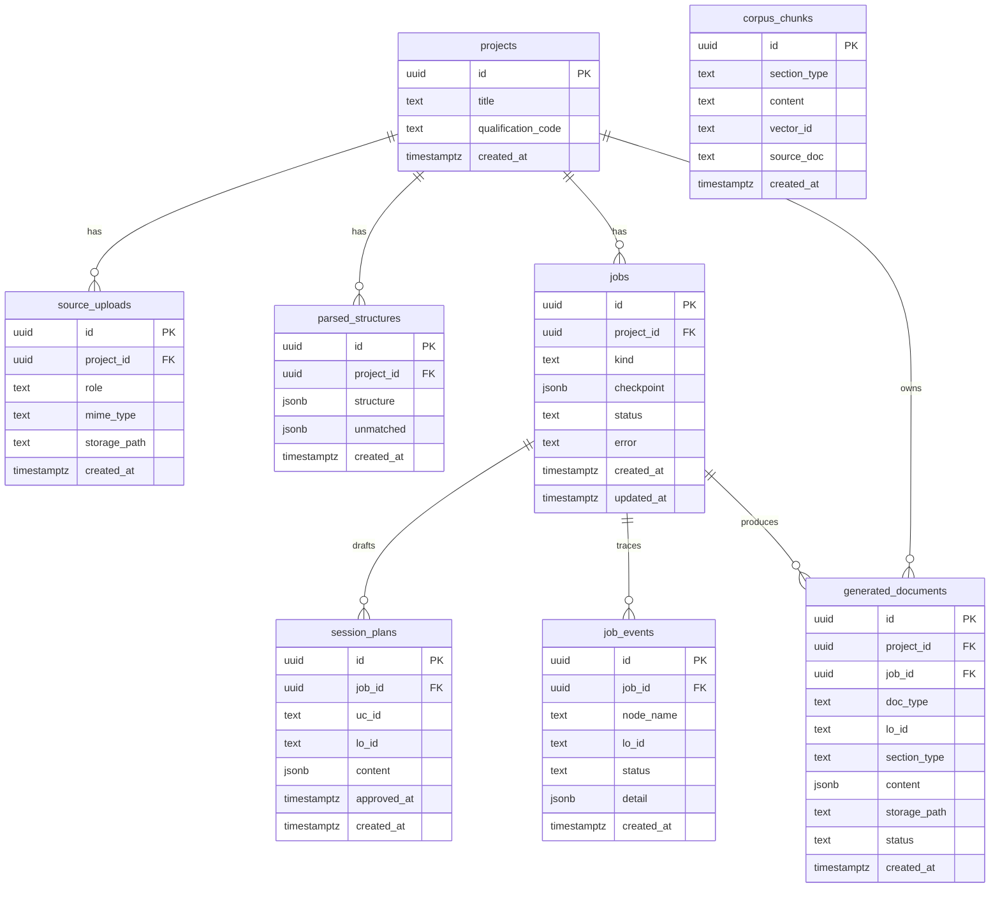
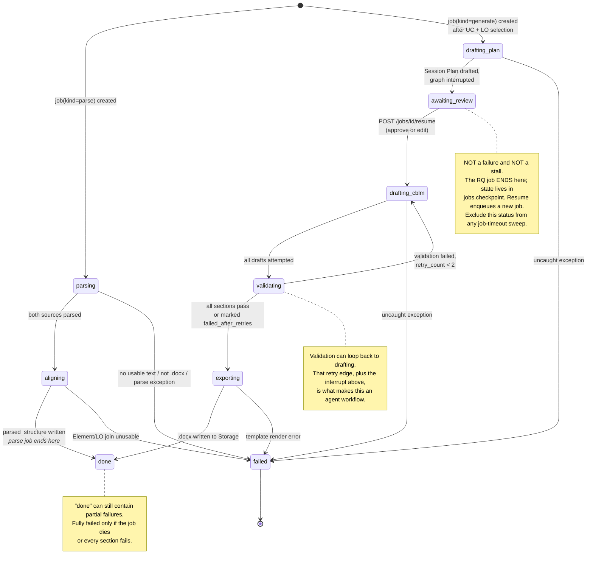
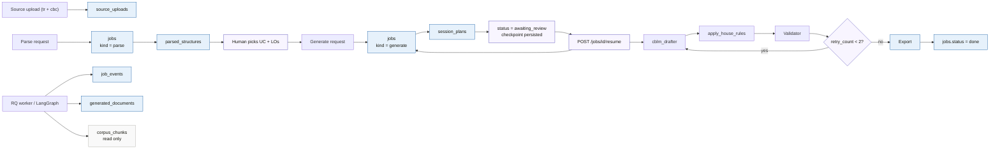
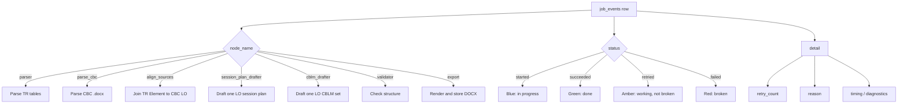

# tesda-cbc-agent — Data Model Diagrams

Source of truth: `SYSTEM_DESIGN.md` §3 and the lifecycle rules in `SYSTEM_DESIGN.md` §5.

**Revised 2026-08-18.** Two required sources, two job kinds, and a human review pause.

These diagrams model the current backend schema and the way it behaves at runtime.
If the source model changes later, update these diagrams first.

## 1. Entity relationships

## 2. Job lifecycle

## 3. Runtime writes

This diagram shows which tables are written during each major phase.

## 4. Event semantics

## 5. Notes

- `job_events` is append-only. The UI should collapse it by `(node_name, lo_id)`.
- `generated_documents.status = failed_after_retries` is not the same as job failure.
- `corpus_chunks` is retained as **RAG insurance only** and is unused by default; the MVP
  retriever is a few-shot lookup with no vector store.
- `awaiting_review` is a normal state, not an error. The RQ job ends at the interrupt and a
  resume enqueues a new one — never hold a worker slot for human latency.
- Resuming must be idempotent: guard on `session_plans.approved_at` being null.
- `generated_documents.content` stores structured content **alongside** the rendered
  `.docx`. This is what keeps the post-MVP chat / "Improve with AI" layer possible without
  re-parsing Word output — see `SYSTEM_DESIGN.md` §9.
- ~~If you later move to the TR + CBC source model…~~ **Done** — `source_uploads` landed
  2026-08-18.
