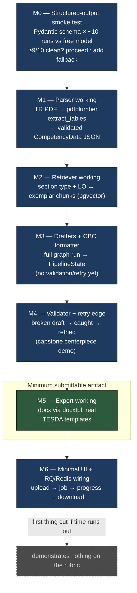
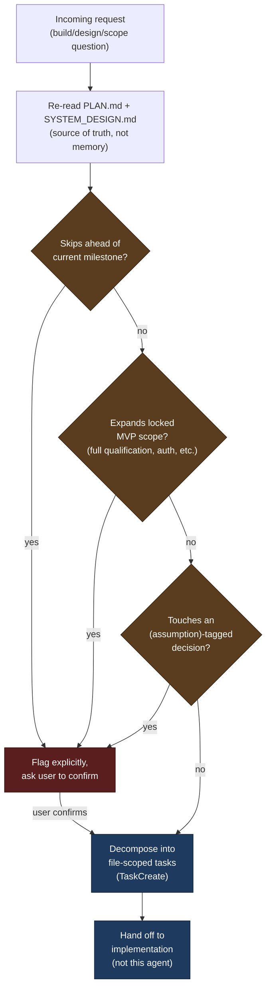

# tesda-cbc-agent — Planning Diagram

Companion to `PLAN.md` / `SYSTEM_DESIGN.md`. Visualizes the milestone sequence
(M0–M6) and the minimum-submittable-artifact cutoff.

## Planning agent decision flow

How `cbc-pipeline-planner` gates work against the locked plan.

