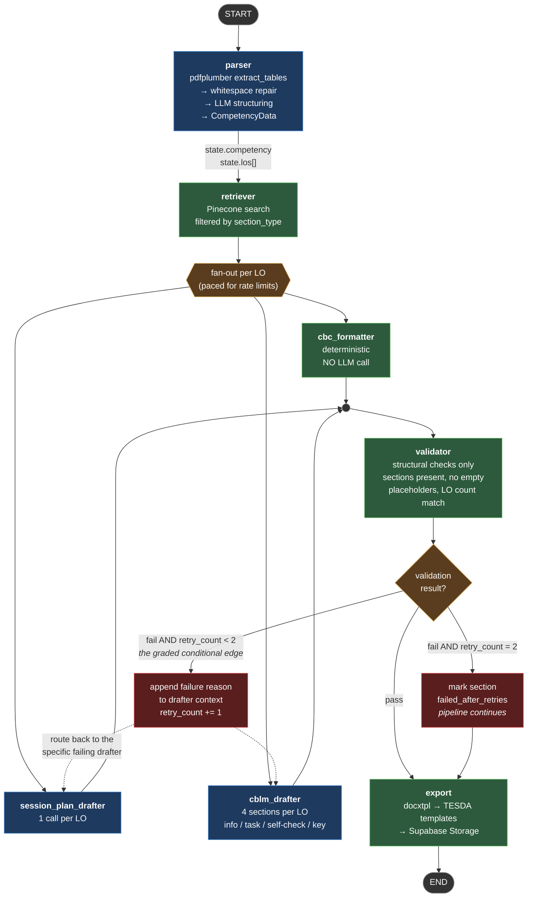
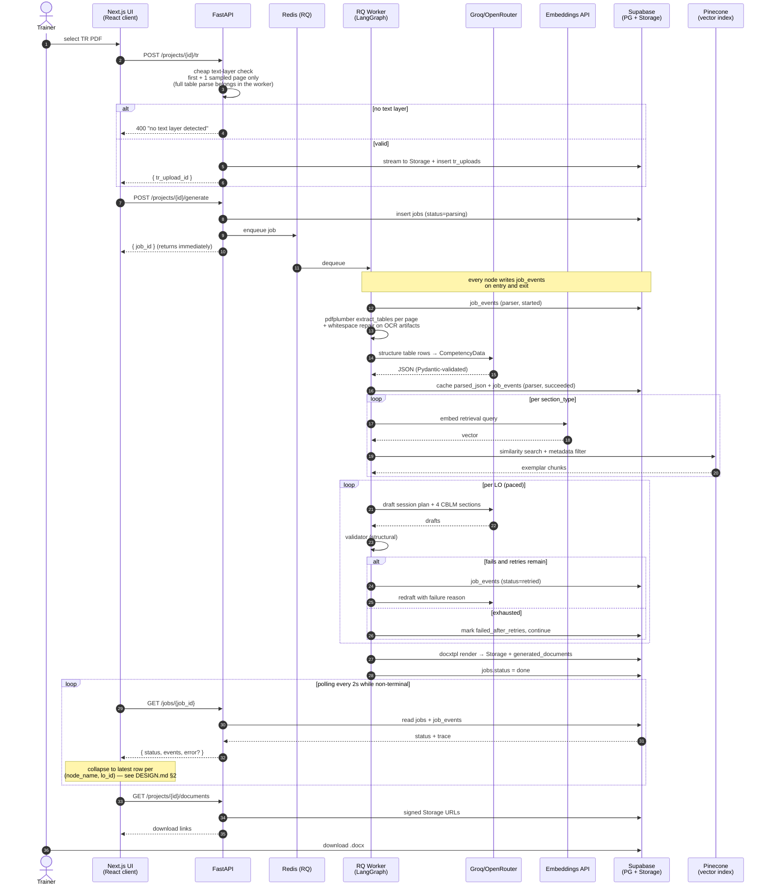
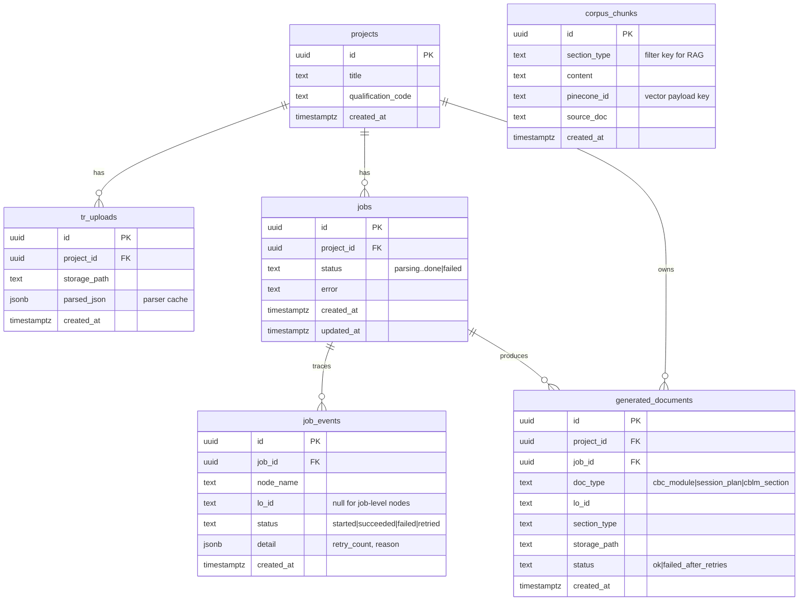
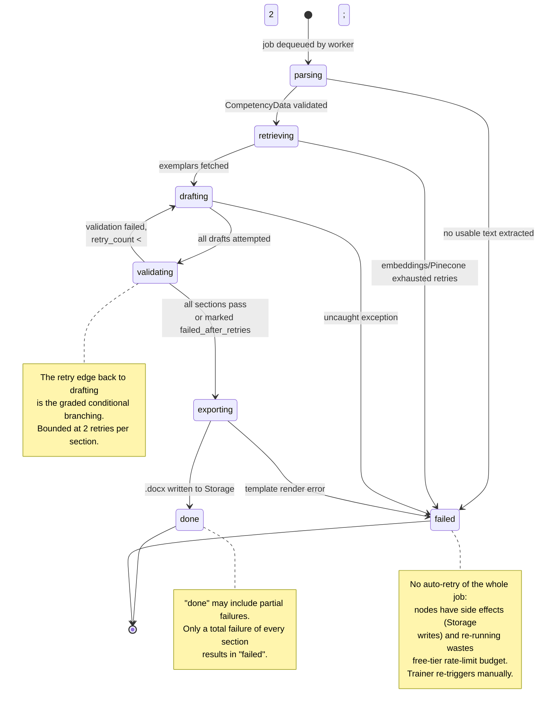
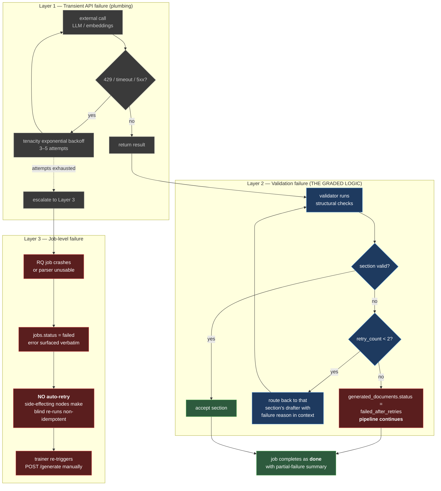
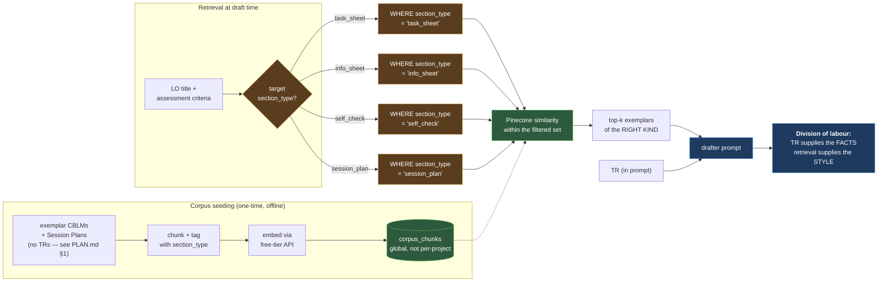
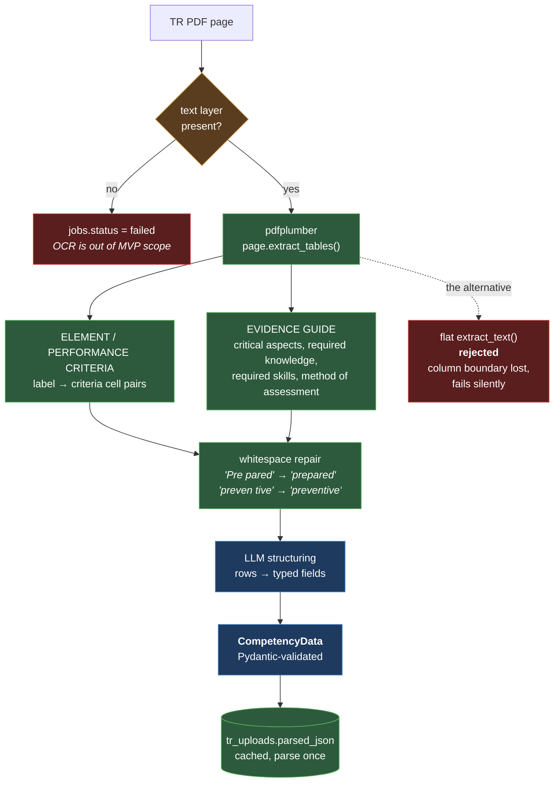
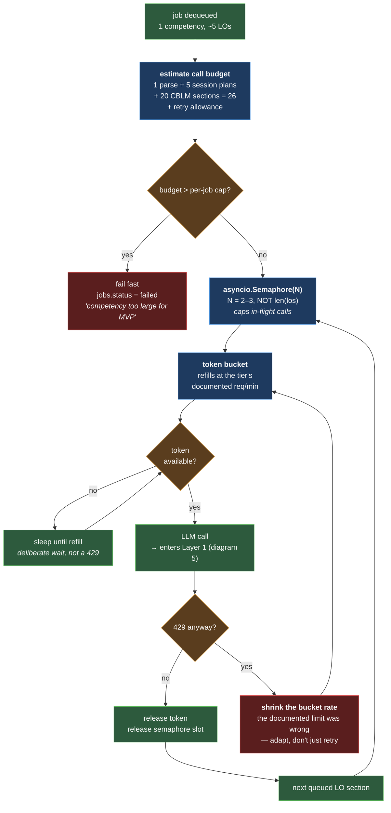
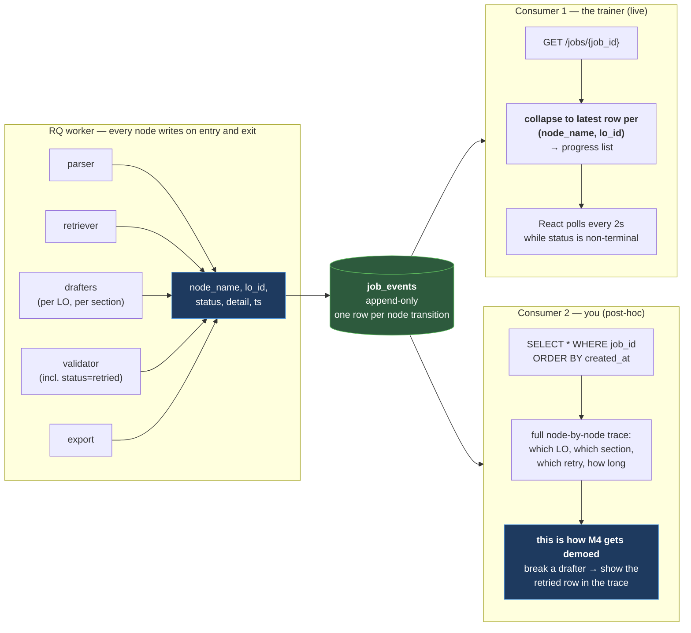

# tesda-cbc-agent — Technical Diagrams

Companion to `PLAN.md` (scope, milestones), `SYSTEM_DESIGN.md` (architecture),
`PLANNING_DIAGRAM.md` (milestone flow), and `USECASE_DIAGRAM.md` (actors/use cases).

All diagrams below are validated Mermaid. Section references point back to the
source-of-truth docs so nothing here drifts silently.

---

## 1. LangGraph pipeline — nodes, state, and the retry edge

The capstone centerpiece. Source: `PLAN.md` §2, `SYSTEM_DESIGN.md` §5.
Blue = LLM node, green = deterministic node, amber = conditional branch, red = failure path.

> **Note vs `USECASE_DIAGRAM.md`:** the CBC Formatter is deterministic and does *not*
> depend on the Validator — only the two Drafter outputs flow through validation and
> the retry edge. This diagram is the accurate one on that point.

---

## 2. Runtime sequence — upload to download

Source: `SYSTEM_DESIGN.md` §2 (data flow) and §4 (API contracts).
Note FastAPI never touches the LLM — all AI work is inside the RQ worker.

---

## 3. Data model — entity relationships

Source: `SYSTEM_DESIGN.md` §3. Note `corpus_chunks` is deliberately unlinked —
the RAG corpus is global, not per-project (trade-off table §7).

---

## 4. Job status lifecycle

Source: `SYSTEM_DESIGN.md` §3 (`jobs.status`) and §5 (failure semantics).
The key subtlety: `done` can include partial failures.

---

## 5. Three distinct failure layers

Source: `SYSTEM_DESIGN.md` §5. The doc's own warning — *don't conflate them* —
is the whole point of this diagram. Only Layer 2 is graded agent logic.

---

## 6. RAG retrieval — section-type filtering, not generic similarity

Source: `PLAN.md` §1 (grounding decision), `SYSTEM_DESIGN.md` §3 (`corpus_chunks`).
The design call worth understanding: retrieval supplies **style**, the TR supplies **facts**.

> **The uploaded TR is never embedded.** It goes into the drafter prompt whole, as
> `CompetencyData`. Chunking it would risk retrieving 3 of 5 elements when the drafter
> needs all of them verbatim. Only the seeded exemplar corpus is vectorised.

---

## 7. Parser internals — why table extraction, not flat text

Source: `SYSTEM_DESIGN.md` §3 (`tr_uploads.parsed_json`), validated against
*TR — Organic Agriculture Production NC II* (91 pages, text layer present).

A TR is tables all the way down. The ELEMENT → PERFORMANCE CRITERIA mapping and the
Evidence Guide both live in cell boundaries. Flat text extraction returns the same
words in reading order with the column boundary gone — the structure must then be
re-inferred by regex, and it fails silently by attaching criteria to the wrong element.

> **Dependency note:** `pdfplumber` only — pure Python, no system deps, no ML stack.
> MarkItDown and PyMuPDF were considered and dropped: MarkItDown wraps flat pypdf
> extraction (the rejected branch above), and Docling's layout model breaks the
> free-tier / no-GPU constraint in `SYSTEM_DESIGN.md` §1.

---

## 8. Rate-limit budget — pacing the fan-out

Source: `PLAN.md` §1 (free-tier LLM), diagram 1 (`fan-out per LO — paced for rate limits`).

Diagram 5 Layer 1 handles *one call* that fails. This diagram handles the different
problem: **the whole job is a burst.** One competency with 5 LOs is 1 parse + 5 session
plans + 20 CBLM sections = **26 LLM calls**, plus a retry allowance of up to 2 per
drafted section (50 more in the worst case). Fired concurrently on a free tier, that
trips the per-minute limit and every worker hits Layer 1 backoff simultaneously —
turning a rate-limit problem into a thundering-herd problem.

The fix is a semaphore plus a token-bucket, *before* the call, not backoff after it.

> **Why this is a separate concern from Layer 1.** Backoff is reactive and per-call:
> it fixes a request that already failed. Pacing is proactive and per-job: it stops the
> burst from happening. Building only the first means the M4 demo stalls in retry storms
> and looks like a broken pipeline. This also caps the *cost* of the retry edge — a
> bounded retry count bounds correctness work, but only the budget check bounds spend.

---

## 9. Observability — one trace per job, two consumers

Source: `SYSTEM_DESIGN.md` §3 (`job_events`), diagram 3 (ER model).

`job_events` already exists in the schema. This diagram is about the thing that makes it
worth having: **the same rows serve both the trainer's progress bar and your debugging.**
No Prometheus, no separate metrics stack — one append-only table, two readers.

> **The rule that makes this work:** a node writes its event row in the *same*
> transaction boundary as its state change. An event log that can disagree with
> `jobs.status` is worse than no event log — you'd debug the logger instead of the
> pipeline.

> **Collapse on the pair, not the node.** The drafters run once per LO, and `job_events`
> carries `lo_id`. Collapsing on `node_name` alone makes LO-2's retry overwrite LO-1's
> success — the trainer watches rows blink between states for no visible reason. The
> correct key is `(node_name, lo_id)`, which yields ~19–24 rows for a 5-LO competency.
> Full UI treatment in `DESIGN.md` §2 (Truth 5) and §8 (N1).

---

## Diagram index

| # | Diagram | Type | Answers |
|---|---------|------|---------|
| 1 | LangGraph pipeline | flowchart | What are the nodes and where is the conditional branching? |
| 2 | Runtime sequence | sequence | Who calls what, in what order, across processes? |
| 3 | Data model | ER | What's persisted and how does it relate? |
| 4 | Job lifecycle | state | What states can a job be in, and what moves it? |
| 5 | Failure layers | flowchart | Which retry mechanism handles which kind of failure? |
| 6 | RAG retrieval | flowchart | How does retrieval stay section-type-aware? |
| 7 | Parser internals | flowchart | Why table extraction rather than flat text? |
| 8 | Rate-limit budget | flowchart | How does a 26-call job avoid tripping the free tier? |
| 9 | Observability | flowchart | Where does the progress bar and the M4 demo trace come from? |
