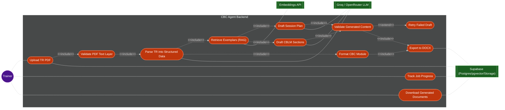

# tesda-cbc-agent — Use Case Diagram

Generated from `PLAN.md` / `SYSTEM_DESIGN.md` via `/generate-usecase-diagram`.

> **Include-chain note:** UC7 (Format CBC Module) branches directly off UC3 (Parse),
> not off UC8 (Validate) — per `PLAN.md` §1 it is a deterministic reformat of already-
> parsed data with no LLM call, so it never enters the validation/retry path. Only the
> Drafter use cases (UC5, UC6) do. Both branches converge on UC10 (Export).
>
> **Validator correction:** UC8 no longer links to the LLM. Per `SYSTEM_DESIGN.md` §5
> and `TECHNICAL_DIAGRAMS.md` §1, the Validator runs *structural* checks only — sections
> present, no empty placeholders, LO count match — with no model call. The LLM edge moved
> to UC3, where structuring the extracted table rows is a genuine model call.

## Actors

| Actor | Description |
|:------|:------------|
| Trainer | End user who uploads TR PDFs, triggers document generation, monitors progress, and downloads outputs |

## External systems (secondary actors)

| System | Role |
|:-------|:-----|
| Groq/OpenRouter LLM | Structures extracted TR table rows, and generates draft session plans and CBLM sections. Does *not* validate — validation is deterministic |
| Embeddings API | Produces vector embeddings for exemplar retrieval (RAG) |
| Supabase | Stores uploaded files, structured data, vectors, job state, and generated documents |

## Use cases

| ID   | Use Case | Description | Actor(s) |
|:-----|:---------|:-------------|:---------|
| UC1  | Upload TR PDF | Trainer uploads a Training Regulation PDF to start a generation job | Trainer |
| UC2  | Validate PDF Text Layer | Confirms an extractable text layer on the first page plus one sampled page. Deliberately cheap — it runs synchronously in the request handler, so it never parses the full document | - |
| UC3  | Parse TR into Structured Data | Extracts ELEMENT/PERFORMANCE CRITERIA and Evidence Guide tables with `pdfplumber.extract_tables()`, repairs OCR whitespace artifacts, then structures the rows into `CompetencyData` via the LLM | - |
| UC4  | Retrieve Exemplars (RAG) | Fetches similar prior documents from the vector store to guide drafting | - |
| UC5  | Draft Session Plan | LLM generates a session plan based on parsed TR data and exemplars | - |
| UC6  | Draft CBLM Sections | LLM generates CBLM content sections based on parsed TR data and exemplars | - |
| UC7  | Format CBC Module | Deterministically reformats parsed TR data (course structure, nominal hours, assessment methods) into the CBC module — no LLM call, no validation/retry path | - |
| UC8  | Validate Generated Content | Structural checks on drafter output — sections present, no empty placeholders, LO count matches the parsed TR. Deterministic, no LLM call | - |
| UC9  | Retry Failed Draft | Re-attempts generation when validation fails | - |
| UC10 | Export to DOCX | Converts the formatted CBC module into a Word document | - |
| UC11 | Track Job Progress | Trainer monitors generation job status in real time | Trainer |
| UC12 | Download Generated Documents | Trainer retrieves finished session plan/CBLM DOCX files | Trainer |
