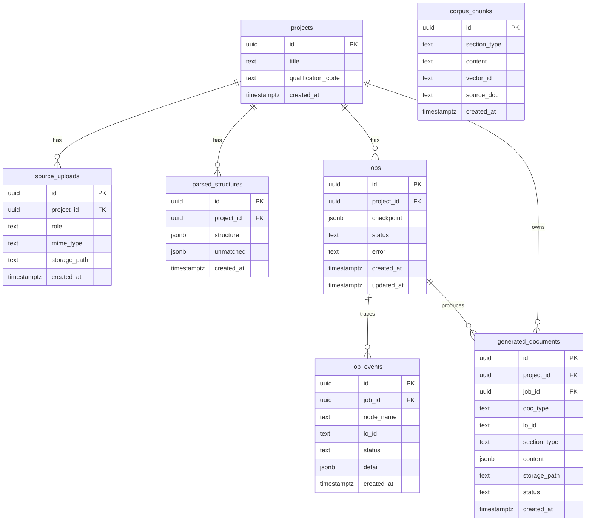
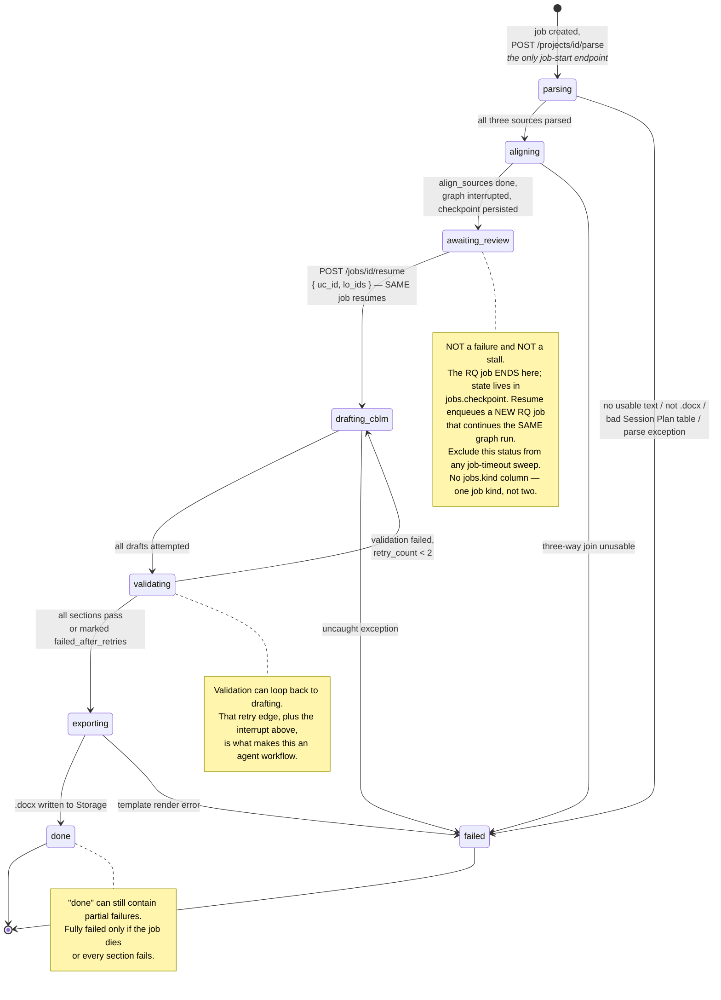
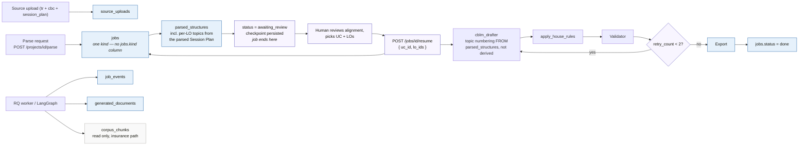
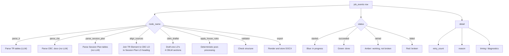

# tesda-cbc-agent — Data Model Diagrams

Source of truth: `SYSTEM_DESIGN.md` §3 and the lifecycle rules in `SYSTEM_DESIGN.md` §5.

**Revised 2026-08-18, then twice more on 2026-08-22.** Three required sources (TR, CBC,
Session Plan — all parsed, none generated), **one** job kind spanning parse through
export, and a single human review pause right after `align_sources` — CBLM is the
system's only generated output.

These diagrams model the current backend schema and the way it behaves at runtime.
If the source model changes later, update these diagrams first.

## 1. Entity relationships

## 2. Job lifecycle

> **What changed vs the previous version:** the old diagram modeled two disconnected
> state machines — `job(kind=parse)` ending at `done` on its own, and a separate
> `job(kind=generate)` starting fresh after `drafting_plan`. That's gone: one job, one
> continuous state machine, `awaiting_review` sitting where the old `parsing→aligning→done`
> chain used to terminate.

## 3. Runtime writes

This diagram shows which tables are written during each major phase.

> **What changed vs the previous version:** no `session_plans` table write — Session
> Plan is parsed input, its topics live in `parsed_structures.structure`. One `jobs` row
> per run, not two (`kind=parse` then `kind=generate`) — `RESUME` loops back into the
> *same* `J0`, not a new `J1`.

## 4. Event semantics

## 5. Notes

- `job_events` is append-only. The UI should collapse it by `(node_name, lo_id)`.
- `generated_documents.status = failed_after_retries` is not the same as job failure.
- `corpus_chunks` is retained as **RAG insurance only** and is unused by default; the MVP
  retriever is a few-shot lookup with no vector store.
- `awaiting_review` is a normal state, not an error. The RQ job ends at the interrupt and a
  resume enqueues a new one — never hold a worker slot for human latency.
- Resuming must be idempotent: guard on `jobs.status` still being `awaiting_review` at
  resume time — there's no `session_plans.approved_at` to guard on any more, the table is
  dropped (Session Plan is parsed input, not an editable artifact this system tracks
  approval for).
- `generated_documents.content` stores structured content **alongside** the rendered
  `.docx`. This is what keeps the post-MVP chat / "Improve with AI" layer possible without
  re-parsing Word output — see `SYSTEM_DESIGN.md` §9.
- ~~If you later move to the TR + CBC source model…~~ **Done** — `source_uploads` landed
  2026-08-18; extended to a third role (`session_plan`) 2026-08-22.
