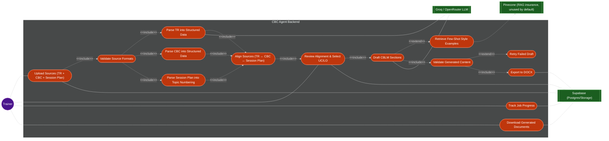

# tesda-cbc-agent — Use Case Diagram

Originally generated via `/generate-usecase-diagram`; hand-updated 2026-08-22 for the
CBLM-only, three-upload, single-job-interrupt reversal (`PLAN.md` §1, `ARCHITECTURE.md`
§3). **Regenerate with a `todiagram` MCP tool next time this needs a full redraw** rather
than hand-editing Mermaid further — see the diagram-generation preference in memory.

> **What changed from the previous version:** this diagram predated even the "two
> required uploads" era — it modeled a single TR upload, RAG-grounded drafting via an
> Embeddings API + vector store, an LLM-formatted CBC module, and a drafted Session Plan.
> None of that is current: CBC and Session Plan are both required uploads (not
> generated), grounding is TR-traceability (not RAG — Embeddings API/vector store removed
> as primary actors), and CBLM is the only generated output. The align/review/select step
> — previously entirely missing from this diagram — is now UC7, the pipeline's one
> LangGraph interrupt.

## Actors

| Actor | Description |
|:------|:------------|
| Trainer | End user who uploads TR/CBC/Session-Plan, reviews the alignment and selects UC/LO, monitors progress, and downloads outputs |

## External systems (secondary actors)

| System | Role |
|:-------|:-----|
| Groq/OpenRouter LLM | Structures extracted TR table rows, and drafts CBLM sections. Does *not* validate — validation is deterministic. CBC and Session Plan parsing use **no LLM** — see UC4/UC5 |
| Supabase | Stores uploaded files, structured data, job state, and generated documents |
| Pinecone | Exemplar-vector backend behind `RetrieverProtocol`, kept as RAG insurance — **unused by default**; the MVP retriever is few-shot, no vector store or embeddings call |

## Use cases

| ID   | Use Case | Description | Actor(s) |
|:-----|:---------|:-------------|:---------|
| UC1  | Upload Sources (TR + CBC + Session Plan) | Trainer uploads all three required sources to start a job — one TR PDF, one Enhanced CBC `.docx`, one Session Plan PDF | Trainer |
| UC2  | Validate Source Formats | TR: extractable text layer present. CBC: really `.docx`. Session Plan: PDF with a recognizable Learning Content column. All synchronous, at upload time — before a job is enqueued | - |
| UC3  | Parse TR into Structured Data | Extracts ELEMENT/PERFORMANCE CRITERIA and Evidence Guide tables with `pdfplumber.extract_tables()`, repairs OCR whitespace artifacts, then structures the rows into `TRData` via the LLM | - |
| UC4  | Parse CBC into Structured Data | Extracts per-LO assessment criteria and topics with `python-docx` — deterministic, **no LLM** | - |
| UC5  | Parse Session Plan into Topic Numbering | Extracts per-LO `TopicRow` (number, content, subtopics) with `pdfplumber.extract_tables()` — deterministic, **no LLM**: numbering is already literal on the page, this extracts rather than interprets | - |
| UC6  | Align Sources (TR ↔ CBC ↔ Session Plan) | Three-way join: TR *Element* ↔ CBC *Learning Outcome* ↔ Session Plan LO heading. Unmatched pairs surfaced, never guessed. No LLM call | - |
| UC7  | Review Alignment & Select UC/LO | The pipeline's one LangGraph interrupt (`interrupt_before` + checkpoint, `jobs.status = awaiting_review`) — not a plain job boundary. Trainer reviews the join and picks a Unit of Competency and Learning Outcome(s); `POST /jobs/{id}/resume` continues the same job | Trainer |
| UC8  | Draft CBLM Sections | LLM generates the four CBLM sections per selected LO — Information Sheet, Task/Job/Operation Sheet, Self-Check, Answer Key — grounded in the TR and CBC, numbered per the parsed Session Plan (UC5), never derived | - |
| UC9  | Retrieve Few-Shot Style Examples | Optional style seam behind `RetrieverProtocol` (few-shot default) — insurance only, not the grounding source. Style itself comes deterministically from the Style Specification Matrix + house rules | - |
| UC10 | Validate Generated Content | Structural checks on drafter output — sections present, no empty placeholders, LO count matches the TR, numbering matches the Session Plan. Deterministic, no LLM call | - |
| UC11 | Retry Failed Draft | Re-attempts CBLM drafting for one section when validation fails, bounded at 2 retries | - |
| UC12 | Export to DOCX | Converts the drafted CBLM sections into Word documents via `docxtpl` against real TESDA templates | - |
| UC13 | Track Job Progress | Trainer monitors job status, including `awaiting_review`, in real time | Trainer |
| UC14 | Download Generated Documents | Trainer retrieves finished CBLM `.docx` files | Trainer |
