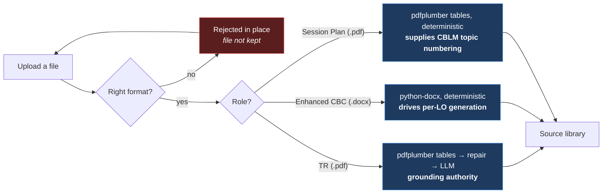
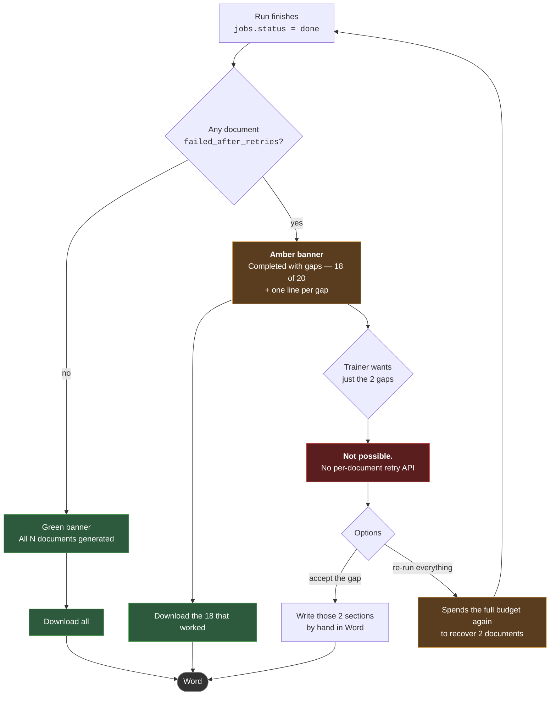
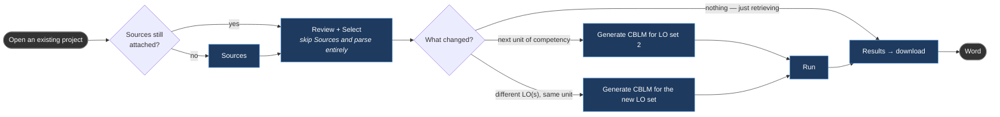

# User Flows

How a trainer actually moves through the CBLM Developer, including every place they can
get blocked and what the interface does about it.

Companion to `USECASE_DIAGRAM.md` (who does what), `TECHNICAL_DIAGRAMS.md` (how the
pipeline runs), and `cblm-developer-ui/DESIGN.md` (what the screens look like).

**One actor.** A TESDA trainer working toward TM I/II. No admin, no reviewer, no second
role — every flow below is one person at one desk.

---

## 1. The primary flow

First document set, from nothing to a `.docx` in Word.

```mermaid
flowchart TD
    START([Trainer opens the app]) --> P{Existing project?}
    P -->|no| NEW["New project<br/><i>title + qualification code</i>"]
    P -->|yes| OPEN["Open project"]
    NEW --> SRC
    OPEN --> SRC

    SRC["<b>Sources</b><br/>add TR (.pdf) + Enhanced CBC (.docx)<br/>+ Session Plan (.pdf)"]
    SRC --> CHK{"Usable TR AND<br/>CBC AND Session Plan?"}
    CHK -->|no| BLOCK["<b>Parse stays unreachable</b><br/>panel names what is missing<br/>and why each source matters"]
    BLOCK --> SRC
    CHK -->|yes| PARSE["<b>Parse</b> &mdash; the only job<br/>parse_tr + parse_cbc + parse_session_plan<br/>align_sources"]

    PARSE --> SEL["<b>Review + Select</b> &nbsp;&#9208; <code>awaiting_review</code><br/><i>LangGraph interrupt, not a job boundary</i><br/>review TR&#8596;CBC&#8596;Session-Plan alignment<br/>pick unit of competency + learning outcome(s)"]
    SEL --> COST{"Within run<br/>budget?"}
    COST -->|no| OVER["<b>Rejected before resuming</b><br/>Generate disabled<br/>suggests a smaller LO scope"]
    OVER --> SEL
    COST -->|yes| GEN["Resume &#8594; POST /jobs/{id}/resume"]

    GEN --> RUN2["<b>Run continues</b> &mdash; same job<br/>drafting_cblm &#8594; validating &#8594; exporting"]
    RUN2 --> OUT{"Outcome"}

    OUT -->|"all documents ok"| CLEAN["<b>Complete</b><br/>green banner"]
    OUT -->|"some failed_after_retries"| PART["<b>Completed with gaps</b><br/>amber banner + gap list"]
    OUT -->|"nothing generated"| FAIL["<b>Run failed</b><br/>red banner + verbatim error"]

    CLEAN --> DL["Download .docx"]
    PART --> DL
    FAIL --> RETRY{"Re-run?"}

    DL --> WORD([Finish in Word])
    RETRY -->|yes| GEN
    RETRY -->|no| SRC

    classDef ok fill:#2d5a3d,stroke:#5cb85c,color:#fff
    classDef warn fill:#5a3d1e,stroke:#d9a04a,color:#fff
    classDef bad fill:#5a1e1e,stroke:#d94a4a,color:#fff
    classDef step fill:#1e3a5f,stroke:#4a90d9,color:#fff
    classDef term fill:#333,stroke:#888,color:#fff

    class SRC,SEL,PARSE,RUN2,GEN,NEW,OPEN step
    class CLEAN,DL ok
    class PART,OVER,BLOCK warn
    class FAIL bad
    class START,WORD term
```

**Both loops return to a screen the trainer can act on.** Missing sources returns to Sources;
over budget returns to Selection. Neither is a dead end, and neither costs a *generation* call.

---

## 2. Where a trainer gets blocked, and what it costs

Four blocking points. **Two of them are free** — they happen before any job is enqueued,
so a blocked trainer has spent nothing. The other two sit behind a job that has already run.

| # | Block | When | Cost | Recovery |
|---|---|---|---|---|
| 1 | **Scanned PDF / wrong format** | inside the upload request | free | Choose another file; the file is not kept |
| 2 | **Missing TR, CBC, or Session Plan** | on the Sources screen | free | Add the missing source |
| 3 | **Over budget** | on Review + Select, pre-resume | **parse already spent** — `parse_tr` uses an LLM to structure the TR | Smaller LO scope |
| 4 | **Run failed** | mid-pipeline | **spent** | Re-run, or change sources first |

#4 is the only one the trainer cannot see coming. #3 exists because Selection sits after
the parse step — the UC/LO dropdowns are populated from `parsed_structure`, so all three
sources must be parsed and joined before there is anything to pick. That is a deliberate
trade: a cheap parse buys a review-and-select screen that cannot offer a unit the sources
don't contain. Unlike the old design, this is now one job's single interrupt, not a
boundary between two independently-triggered jobs — see `ARCHITECTURE.md` §3 for why that
distinction is kept even though it costs slightly more machinery.

**Role is the branch that matters most and the one a trainer is least likely to notice.**
The three roles are parsed by different code paths and are not interchangeable: a `.docx`
tagged as TR hits `pdfplumber` and yields nothing. That is why the Add Source modal makes
role explicit and editable before the file is committed.

**There is no Reference role in the MVP.** Exemplar retrieval was cut along with the vector
store (`PLAN.md` §1, Grounding + Vector store rows) — style now comes deterministically from
the 2026 Style Specification Matrix, not from a corpus. Three uploads exist (TR, CBC,
Session Plan — REVISED 2026-08-22, was two), all required, none generated.

---

## 3. The partial-failure flow

The normal completion, not the exception — and the one place the design deliberately
refuses to give the trainer what they want.

**The refusal is the design.** There is no per-document retry endpoint, so a per-row retry
button could only ever restart the whole run — its label would be a lie regardless of
wording. The interface says so in the re-run confirmation instead of pretending.

**The banner is derived from the documents list, never from `jobs.status`.** A run is `done`
whether it produced 20 of 20 or 18 of 20. Deriving the banner from status alone would show
green over a gap, and the trainer would discover it in Word days later — after submitting.

---

## 4. The returning trainer

Second and later visits are much shorter, because sources persist per project.

**The most common repeat path is picking a different LO set and generating CBLM directly**
— there is no longer a Session-Plan-then-CBLM two-phase order to plan around (Session Plan
is a fixed upload, not a generated intermediate). This also removed the old "5 calls,
review, then 20" pacing rationale for that ordering — see `PLAN.md` §1 Session Plan row for
why.

---

## 5. Flow-level decisions this exposes

Things that only become visible once the flows are laid side by side.

**A trainer can reach Results without ever running anything.** Nav is always available, so
Results must have a real empty state, not a blank screen. Covered.

**Selection is unreachable without all three sources parsed, but Run and Results are not.**
A trainer can navigate to a previous run's results at any time. That is correct — results
are durable, Selection is a decision that needs parsed inputs.

**Review is a halt, not a block.** `awaiting_review` is the one state where the pipeline is
healthy and still will not advance: `draft_cblm` runs only after `POST /jobs/{id}/resume`.
It costs nothing to sit there, but the run is not finished and the trainer is the only thing
that can move it. It needs a screen for exactly that reason — and it is now the pipeline's
*only* halt, reviewing the TR↔CBC↔Session-Plan alignment rather than an editable Session
Plan draft (there's nothing left to edit; Session Plan is a fixed upload).

**Nothing in the product deletes a document.** Re-running overwrites; there is no destructive
action anywhere in these flows. Worth keeping that way.

**The only irreversible spend is Generate.** Every other control is free and reversible.
That is why cost is shown on the button itself — `Generate 20 CBLM` — rather than in a
tooltip.

### Open flow questions

- **Does a re-run replace the previous run's documents, or sit alongside them?** The Results
  screen groups by run, implying alongside. That means storage grows per re-run and the
  trainer must know which set is current. Flagged in `cblm-developer-ui/DESIGN.md` §9.
- **What happens when a trainer swaps the CBC after generating?** The existing documents were
  built from the old curriculum. Nothing currently marks them stale.
- **Is there a flow for a unit with no CBC module?** Today it is disabled in the selector.
  There is no path that lets a trainer proceed with TR-only for that unit, and that is
  probably right — but it is a decision, not an oversight.
